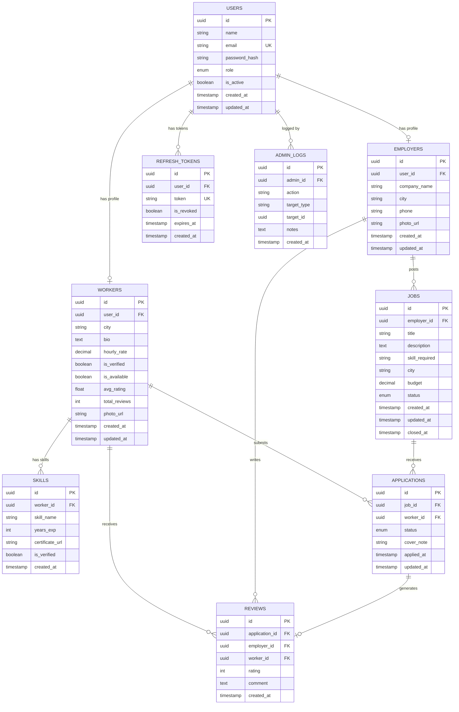

# ER Diagram — SkillBridge Database

This document describes the complete relational database schema for SkillBridge, including all tables, columns, data types, constraints, and relationships.

---

## ER Diagram



---

## Table Descriptions

### USERS
Central identity table. Every person on the platform — worker, employer, or admin — has exactly one row here.

| Column | Type | Constraints | Description |
|---|---|---|---|
| `id` | UUID | PK, default gen_random_uuid() | Unique user identifier |
| `name` | VARCHAR(100) | NOT NULL | Full name |
| `email` | VARCHAR(255) | NOT NULL, UNIQUE | Login email |
| `password_hash` | VARCHAR(255) | NOT NULL | bcrypt hash of password |
| `role` | ENUM | NOT NULL | `WORKER`, `EMPLOYER`, `ADMIN` |
| `is_active` | BOOLEAN | NOT NULL, default true | False if suspended |
| `created_at` | TIMESTAMP | NOT NULL, default now() | Account creation time |
| `updated_at` | TIMESTAMP | NOT NULL | Last update timestamp |

**Indexes:** `email` (unique), `role`

---

### WORKERS
Extended profile for users with role `WORKER`. One-to-one with USERS.

| Column | Type | Constraints | Description |
|---|---|---|---|
| `id` | UUID | PK | Worker profile ID |
| `user_id` | UUID | FK → USERS.id, UNIQUE | Links to base user |
| `city` | VARCHAR(100) | NOT NULL | City where worker operates |
| `bio` | TEXT | | Short self-description |
| `hourly_rate` | DECIMAL(10,2) | NOT NULL | Rate in INR per hour |
| `is_verified` | BOOLEAN | NOT NULL, default false | Admin-verified credentials |
| `is_available` | BOOLEAN | NOT NULL, default true | Available for work |
| `avg_rating` | FLOAT | default 0.0 | Computed from REVIEWS |
| `total_reviews` | INT | default 0 | Count of reviews received |
| `photo_url` | VARCHAR(500) | | Cloudinary profile photo URL |
| `created_at` | TIMESTAMP | NOT NULL, default now() | Profile creation time |
| `updated_at` | TIMESTAMP | NOT NULL | Last update |

**Indexes:** `user_id` (unique), `city`, `is_verified`, `avg_rating`

---

### SKILLS
Each row is one skill belonging to a worker. A worker can have many skills.

| Column | Type | Constraints | Description |
|---|---|---|---|
| `id` | UUID | PK | Skill record ID |
| `worker_id` | UUID | FK → WORKERS.id | Owning worker |
| `skill_name` | VARCHAR(100) | NOT NULL | e.g. "Electrician", "Plumber" |
| `years_exp` | INT | NOT NULL | Years of experience |
| `certificate_url` | VARCHAR(500) | | Cloudinary URL for certificate |
| `is_verified` | BOOLEAN | NOT NULL, default false | Admin verified this skill |
| `created_at` | TIMESTAMP | NOT NULL, default now() | When skill was added |

**Indexes:** `worker_id`, `skill_name`

**Constraint:** `(worker_id, skill_name)` — unique together, a worker cannot list the same skill twice.

---

### EMPLOYERS
Extended profile for users with role `EMPLOYER`. One-to-one with USERS.

| Column | Type | Constraints | Description |
|---|---|---|---|
| `id` | UUID | PK | Employer profile ID |
| `user_id` | UUID | FK → USERS.id, UNIQUE | Links to base user |
| `company_name` | VARCHAR(200) | | Optional company or household name |
| `city` | VARCHAR(100) | NOT NULL | Employer's city |
| `phone` | VARCHAR(15) | | Contact number |
| `photo_url` | VARCHAR(500) | | Profile photo URL |
| `created_at` | TIMESTAMP | NOT NULL, default now() | Profile creation time |
| `updated_at` | TIMESTAMP | NOT NULL | Last update |

**Indexes:** `user_id` (unique), `city`

---

### JOBS
Job postings created by employers. One employer → many jobs.

| Column | Type | Constraints | Description |
|---|---|---|---|
| `id` | UUID | PK | Job ID |
| `employer_id` | UUID | FK → EMPLOYERS.id | Who posted the job |
| `title` | VARCHAR(200) | NOT NULL | Job title |
| `description` | TEXT | | Detailed job description |
| `skill_required` | VARCHAR(100) | NOT NULL | Skill category needed |
| `city` | VARCHAR(100) | NOT NULL | Job location |
| `budget` | DECIMAL(10,2) | NOT NULL | Offered budget in INR |
| `status` | ENUM | NOT NULL, default `OPEN` | `OPEN`, `IN_PROGRESS`, `CLOSED` |
| `created_at` | TIMESTAMP | NOT NULL, default now() | When job was posted |
| `updated_at` | TIMESTAMP | NOT NULL | Last update |
| `closed_at` | TIMESTAMP | | When job was closed |

**Indexes:** `employer_id`, `skill_required`, `city`, `status`

---

### APPLICATIONS
Tracks every application — whether a worker applied to a job or an employer sent a direct hire request.

| Column | Type | Constraints | Description |
|---|---|---|---|
| `id` | UUID | PK | Application ID |
| `job_id` | UUID | FK → JOBS.id | Which job |
| `worker_id` | UUID | FK → WORKERS.id | Which worker |
| `status` | ENUM | NOT NULL, default `PENDING` | `PENDING`, `ACCEPTED`, `REJECTED`, `COMPLETED` |
| `cover_note` | VARCHAR(500) | | Optional message from worker |
| `applied_at` | TIMESTAMP | NOT NULL, default now() | Application timestamp |
| `updated_at` | TIMESTAMP | NOT NULL | Last status change |

**Indexes:** `job_id`, `worker_id`, `status`

**Constraint:** `(job_id, worker_id)` — unique together, a worker cannot apply to the same job twice.

---

### REVIEWS
Post-job ratings and comments left by employers about workers. One review per completed application.

| Column | Type | Constraints | Description |
|---|---|---|---|
| `id` | UUID | PK | Review ID |
| `application_id` | UUID | FK → APPLICATIONS.id, UNIQUE | Which completed job |
| `employer_id` | UUID | FK → EMPLOYERS.id | Who wrote the review |
| `worker_id` | UUID | FK → WORKERS.id | Who is being reviewed |
| `rating` | INT | NOT NULL, CHECK 1–5 | Star rating |
| `comment` | TEXT | | Written review |
| `created_at` | TIMESTAMP | NOT NULL, default now() | Review submission time |

**Indexes:** `worker_id`, `employer_id`, `application_id` (unique)

**Constraint:** `application_id` is UNIQUE — enforces one review per completed job.

---

### REFRESH_TOKENS
Stores active refresh tokens for JWT rotation. Revoked on logout or suspicious activity.

| Column | Type | Constraints | Description |
|---|---|---|---|
| `id` | UUID | PK | Token record ID |
| `user_id` | UUID | FK → USERS.id | Token owner |
| `token` | VARCHAR(512) | NOT NULL, UNIQUE | Hashed refresh token string |
| `is_revoked` | BOOLEAN | NOT NULL, default false | True after logout or rotation |
| `expires_at` | TIMESTAMP | NOT NULL | Token expiry (7 days) |
| `created_at` | TIMESTAMP | NOT NULL, default now() | Token issue time |

**Indexes:** `token` (unique), `user_id`, `is_revoked`

---

### ADMIN_LOGS
Audit trail of all admin actions — verification, suspension, removal.

| Column | Type | Constraints | Description |
|---|---|---|---|
| `id` | UUID | PK | Log entry ID |
| `admin_id` | UUID | FK → USERS.id | Which admin performed the action |
| `action` | VARCHAR(100) | NOT NULL | e.g. `VERIFY_WORKER`, `SUSPEND_USER` |
| `target_type` | VARCHAR(50) | NOT NULL | e.g. `WORKER`, `USER`, `REVIEW` |
| `target_id` | UUID | NOT NULL | ID of the affected record |
| `notes` | TEXT | | Admin's optional notes |
| `created_at` | TIMESTAMP | NOT NULL, default now() | When action was performed |

**Indexes:** `admin_id`, `target_type`, `target_id`, `created_at`

---

## Enum Definitions

```sql
-- User roles
CREATE TYPE user_role AS ENUM ('WORKER', 'EMPLOYER', 'ADMIN');

-- Job status lifecycle
CREATE TYPE job_status AS ENUM ('OPEN', 'IN_PROGRESS', 'CLOSED');

-- Application status lifecycle
CREATE TYPE application_status AS ENUM ('PENDING', 'ACCEPTED', 'REJECTED', 'COMPLETED');
```

---

## Relationship Summary

| Relationship | Type | Description |
|---|---|---|
| USERS → WORKERS | One-to-One | Each worker user has exactly one worker profile |
| USERS → EMPLOYERS | One-to-One | Each employer user has exactly one employer profile |
| USERS → REFRESH_TOKENS | One-to-Many | A user can have multiple active refresh tokens (multi-device) |
| WORKERS → SKILLS | One-to-Many | A worker can list multiple skills |
| EMPLOYERS → JOBS | One-to-Many | An employer can post multiple jobs |
| JOBS → APPLICATIONS | One-to-Many | A job can receive many applications |
| WORKERS → APPLICATIONS | One-to-Many | A worker can apply to many jobs |
| APPLICATIONS → REVIEWS | One-to-One | Each completed application generates at most one review |
| WORKERS → REVIEWS | One-to-Many | A worker can receive many reviews over time |
| EMPLOYERS → REVIEWS | One-to-Many | An employer can write many reviews |
| USERS → ADMIN_LOGS | One-to-Many | All admin actions are logged against the admin user |

---

## Key Design Decisions

### UUIDs as Primary Keys
All tables use UUID primary keys instead of auto-increment integers. This avoids sequential ID enumeration attacks, makes IDs safe to expose in URLs, and supports future distributed database scaling.

### Separation of USERS and WORKERS / EMPLOYERS
The `USERS` table stores only authentication data. Profile data lives in `WORKERS` or `EMPLOYERS`. This is the **Single Responsibility Principle** applied to schema design — the auth layer never mixes with business data.

### avg_rating as Denormalised Column
`WORKERS.avg_rating` is stored directly rather than computed on every query. It is recalculated each time a new review is added. This is a deliberate **performance trade-off** — reads (search) are far more frequent than writes (new review), so denormalisation is justified.

### APPLICATIONS as the Central Join Table
`APPLICATIONS` is not just a join table — it is a first-class entity that tracks the full lifecycle of a hire (`PENDING → ACCEPTED → COMPLETED`). Both worker-applied and employer-direct-hire flows create an `APPLICATIONS` record. This unified model keeps the hire tracking logic in one place.

### REFRESH_TOKENS Table
Instead of storing refresh tokens in the user record, a separate table allows multiple active sessions (worker logged in on phone + tablet), easy revocation per device, and full token audit history.

### ADMIN_LOGS for Audit Trail
Every admin action is logged with the admin ID, action type, target, and timestamp. This supports accountability, debugging, and future compliance requirements.

---

## Prisma Schema (Implementation Reference)

```prisma
// prisma/schema.prisma

generator client {
  provider = "prisma-client-js"
}

datasource db {
  provider = "postgresql"
  url      = env("DATABASE_URL")
}

enum Role {
  WORKER
  EMPLOYER
  ADMIN
}

enum JobStatus {
  OPEN
  IN_PROGRESS
  CLOSED
}

enum ApplicationStatus {
  PENDING
  ACCEPTED
  REJECTED
  COMPLETED
}

model User {
  id           String         @id @default(uuid())
  name         String
  email        String         @unique
  passwordHash String
  role         Role
  isActive     Boolean        @default(true)
  createdAt    DateTime       @default(now())
  updatedAt    DateTime       @updatedAt
  worker       Worker?
  employer     Employer?
  refreshTokens RefreshToken[]
  adminLogs    AdminLog[]
}

model Worker {
  id           String        @id @default(uuid())
  userId       String        @unique
  city         String
  bio          String?
  hourlyRate   Decimal
  isVerified   Boolean       @default(false)
  isAvailable  Boolean       @default(true)
  avgRating    Float         @default(0.0)
  totalReviews Int           @default(0)
  photoUrl     String?
  createdAt    DateTime      @default(now())
  updatedAt    DateTime      @updatedAt
  user         User          @relation(fields: [userId], references: [id])
  skills       Skill[]
  applications Application[]
  reviews      Review[]
}

model Skill {
  id             String   @id @default(uuid())
  workerId       String
  skillName      String
  yearsExp       Int
  certificateUrl String?
  isVerified     Boolean  @default(false)
  createdAt      DateTime @default(now())
  worker         Worker   @relation(fields: [workerId], references: [id])

  @@unique([workerId, skillName])
}

model Employer {
  id          String   @id @default(uuid())
  userId      String   @unique
  companyName String?
  city        String
  phone       String?
  photoUrl    String?
  createdAt   DateTime @default(now())
  updatedAt   DateTime @updatedAt
  user        User     @relation(fields: [userId], references: [id])
  jobs        Job[]
  reviews     Review[]
}

model Job {
  id            String        @id @default(uuid())
  employerId    String
  title         String
  description   String?
  skillRequired String
  city          String
  budget        Decimal
  status        JobStatus     @default(OPEN)
  createdAt     DateTime      @default(now())
  updatedAt     DateTime      @updatedAt
  closedAt      DateTime?
  employer      Employer      @relation(fields: [employerId], references: [id])
  applications  Application[]
}

model Application {
  id        String            @id @default(uuid())
  jobId     String
  workerId  String
  status    ApplicationStatus @default(PENDING)
  coverNote String?
  appliedAt DateTime          @default(now())
  updatedAt DateTime          @updatedAt
  job       Job               @relation(fields: [jobId], references: [id])
  worker    Worker            @relation(fields: [workerId], references: [id])
  review    Review?

  @@unique([jobId, workerId])
}

model Review {
  id            String      @id @default(uuid())
  applicationId String      @unique
  employerId    String
  workerId      String
  rating        Int
  comment       String?
  createdAt     DateTime    @default(now())
  application   Application @relation(fields: [applicationId], references: [id])
  employer      Employer    @relation(fields: [employerId], references: [id])
  worker        Worker      @relation(fields: [workerId], references: [id])
}

model RefreshToken {
  id        String   @id @default(uuid())
  userId    String
  token     String   @unique
  isRevoked Boolean  @default(false)
  expiresAt DateTime
  createdAt DateTime @default(now())
  user      User     @relation(fields: [userId], references: [id])
}

model AdminLog {
  id         String   @id @default(uuid())
  adminId    String
  action     String
  targetType String
  targetId   String
  notes      String?
  createdAt  DateTime @default(now())
  admin      User     @relation(fields: [adminId], references: [id])
}
```