# Class Diagram — SkillBridge Backend

```mermaid
classDiagram

    %% ─── Base Entity ───────────────────────────────────────────
    class BaseEntity {
        +String id
        +Date createdAt
        +Date updatedAt
    }

    %% ─── Enums ─────────────────────────────────────────────────
    class Role {
        <<enumeration>>
        WORKER
        EMPLOYER
        ADMIN
    }

    class JobStatus {
        <<enumeration>>
        OPEN
        IN_PROGRESS
        CLOSED
    }

    class ApplicationStatus {
        <<enumeration>>
        PENDING
        ACCEPTED
        REJECTED
        COMPLETED
    }

    %% ─── Domain Models ──────────────────────────────────────────
    class User {
        +String name
        +String email
        +String passwordHash
        +Role role
        +Boolean isActive
        +Worker? worker
        +Employer? employer
        +RefreshToken[] refreshTokens
    }

    class Worker {
        +String userId
        +String city
        +String? bio
        +Number hourlyRate
        +Boolean isVerified
        +Boolean isAvailable
        +Number avgRating
        +Number totalReviews
        +String? photoUrl
        +Skill[] skills
        +Application[] applications
        +Review[] reviews
    }

    class Employer {
        +String userId
        +String? companyName
        +String city
        +String? phone
        +String? photoUrl
        +Job[] jobs
        +Review[] reviews
    }

    class Skill {
        +String workerId
        +String skillName
        +Number yearsExp
        +String? certificateUrl
        +Boolean isVerified
    }

    class Job {
        +String employerId
        +String title
        +String? description
        +String skillRequired
        +String city
        +Number budget
        +JobStatus status
        +Date? closedAt
        +Application[] applications
    }

    class Application {
        +String jobId
        +String workerId
        +ApplicationStatus status
        +String? coverNote
        +Date appliedAt
        +Review? review
    }

    class Review {
        +String applicationId
        +String employerId
        +String workerId
        +Number rating
        +String? comment
    }

    class RefreshToken {
        +String userId
        +String token
        +Boolean isRevoked
        +Date expiresAt
    }

    class AdminLog {
        +String adminId
        +String action
        +String targetType
        +String targetId
        +String? notes
    }

    %% ─── Repository Interfaces ──────────────────────────────────
    class IUserRepository {
        <<interface>>
        +findById(id: String) User
        +findByEmail(email: String) User
        +create(data: CreateUserDTO) User
        +update(id: String, data: UpdateUserDTO) User
        +delete(id: String) void
    }

    class IWorkerRepository {
        <<interface>>
        +findById(id: String) Worker
        +findByUserId(userId: String) Worker
        +findAll(filters: WorkerFilters) Worker[]
        +create(data: CreateWorkerDTO) Worker
        +update(id: String, data: UpdateWorkerDTO) Worker
        +setVerified(id: String, value: Boolean) Worker
        +updateRating(id: String, avg: Number, count: Number) Worker
    }

    class IJobRepository {
        <<interface>>
        +findById(id: String) Job
        +findAll(filters: JobFilters) Job[]
        +findByEmployerId(employerId: String) Job[]
        +create(data: CreateJobDTO) Job
        +updateStatus(id: String, status: JobStatus) Job
    }

    class IApplicationRepository {
        <<interface>>
        +findById(id: String) Application
        +findByJobId(jobId: String) Application[]
        +findByWorkerAndJob(workerId: String, jobId: String) Application
        +create(data: CreateApplicationDTO) Application
        +updateStatus(id: String, status: ApplicationStatus) Application
        +rejectOthers(jobId: String, exceptId: String) void
    }

    class IReviewRepository {
        <<interface>>
        +findByApplicationId(applicationId: String) Review
        +findByWorkerId(workerId: String) Review[]
        +create(data: CreateReviewDTO) Review
        +calcAvgRating(workerId: String) RatingResult
    }

    %% ─── Concrete Repositories ──────────────────────────────────
    class UserRepository {
        -PrismaClient prisma
        +findById(id: String) User
        +findByEmail(email: String) User
        +create(data: CreateUserDTO) User
        +update(id: String, data: UpdateUserDTO) User
        +delete(id: String) void
    }

    class WorkerRepository {
        -PrismaClient prisma
        +findById(id: String) Worker
        +findByUserId(userId: String) Worker
        +findAll(filters: WorkerFilters) Worker[]
        +create(data: CreateWorkerDTO) Worker
        +update(id: String, data: UpdateWorkerDTO) Worker
        +setVerified(id: String, value: Boolean) Worker
        +updateRating(id: String, avg: Number, count: Number) Worker
    }

    class JobRepository {
        -PrismaClient prisma
        +findById(id: String) Job
        +findAll(filters: JobFilters) Job[]
        +findByEmployerId(id: String) Job[]
        +create(data: CreateJobDTO) Job
        +updateStatus(id: String, status: JobStatus) Job
    }

    class ApplicationRepository {
        -PrismaClient prisma
        +findById(id: String) Application
        +findByJobId(jobId: String) Application[]
        +findByWorkerAndJob(workerId: String, jobId: String) Application
        +create(data: CreateApplicationDTO) Application
        +updateStatus(id: String, status: ApplicationStatus) Application
        +rejectOthers(jobId: String, exceptId: String) void
    }

    class ReviewRepository {
        -PrismaClient prisma
        +findByApplicationId(applicationId: String) Review
        +findByWorkerId(workerId: String) Review[]
        +create(data: CreateReviewDTO) Review
        +calcAvgRating(workerId: String) RatingResult
    }

    %% ─── Services ───────────────────────────────────────────────
    class AuthService {
        -IUserRepository userRepo
        -JwtHelper jwtHelper
        +register(dto: RegisterDTO) AuthResponse
        +login(dto: LoginDTO) AuthResponse
        +refreshToken(token: String) TokenPair
        +logout(userId: String, token: String) void
        -hashPassword(password: String) String
        -comparePassword(plain: String, hash: String) Boolean
    }

    class WorkerService {
        -IWorkerRepository workerRepo
        +createProfile(userId: String, dto: CreateWorkerDTO) Worker
        +updateProfile(workerId: String, dto: UpdateWorkerDTO) Worker
        +addSkill(workerId: String, dto: AddSkillDTO) Skill
        +removeSkill(workerId: String, skillId: String) void
        +searchWorkers(filters: WorkerFilters) PaginatedResult
        +getWorkerById(id: String) WorkerProfile
        +setAvailability(workerId: String, value: Boolean) Worker
    }

    class JobService {
        -IJobRepository jobRepo
        +createJob(employerId: String, dto: CreateJobDTO) Job
        +getJobById(id: String) Job
        +listJobs(filters: JobFilters) PaginatedResult
        +closeJob(jobId: String, employerId: String) Job
        +updateStatus(jobId: String, status: JobStatus) Job
    }

    class ApplicationService {
        -IApplicationRepository appRepo
        -IJobRepository jobRepo
        -IWorkerRepository workerRepo
        +apply(workerId: String, jobId: String, note: String) Application
        +directHire(employerId: String, workerId: String, jobId: String) Application
        +acceptApplication(appId: String, employerId: String) Application
        +rejectApplication(appId: String, employerId: String) Application
        +completeJob(appId: String, employerId: String) Application
        +getApplicationsForJob(jobId: String) Application[]
        +getWorkerApplications(workerId: String) Application[]
    }

    class ReviewService {
        -IReviewRepository reviewRepo
        -IWorkerRepository workerRepo
        -IApplicationRepository appRepo
        +createReview(employerId: String, dto: CreateReviewDTO) Review
        +getWorkerReviews(workerId: String) Review[]
    }

    class AdminService {
        -IWorkerRepository workerRepo
        -IUserRepository userRepo
        -AdminRepository adminRepo
        +getUnverifiedWorkers() Worker[]
        +verifyWorker(adminId: String, workerId: String) Worker
        +rejectVerification(adminId: String, workerId: String) void
        +suspendUser(adminId: String, userId: String) User
        +removeUser(adminId: String, userId: String) void
        +getAnalytics() PlatformStats
    }

    %% ─── Controllers ────────────────────────────────────────────
    class AuthController {
        -AuthService authService
        +register(req: Request, res: Response) void
        +login(req: Request, res: Response) void
        +refresh(req: Request, res: Response) void
        +logout(req: Request, res: Response) void
    }

    class WorkerController {
        -WorkerService workerService
        +createProfile(req: Request, res: Response) void
        +updateProfile(req: Request, res: Response) void
        +addSkill(req: Request, res: Response) void
        +removeSkill(req: Request, res: Response) void
        +search(req: Request, res: Response) void
        +getById(req: Request, res: Response) void
        +setAvailability(req: Request, res: Response) void
    }

    class JobController {
        -JobService jobService
        +create(req: Request, res: Response) void
        +getById(req: Request, res: Response) void
        +list(req: Request, res: Response) void
        +close(req: Request, res: Response) void
    }

    class ApplicationController {
        -ApplicationService applicationService
        +apply(req: Request, res: Response) void
        +directHire(req: Request, res: Response) void
        +accept(req: Request, res: Response) void
        +reject(req: Request, res: Response) void
        +complete(req: Request, res: Response) void
        +listForJob(req: Request, res: Response) void
    }

    class ReviewController {
        -ReviewService reviewService
        +create(req: Request, res: Response) void
        +listForWorker(req: Request, res: Response) void
    }

    class AdminController {
        -AdminService adminService
        +getUnverified(req: Request, res: Response) void
        +verify(req: Request, res: Response) void
        +suspend(req: Request, res: Response) void
        +remove(req: Request, res: Response) void
        +analytics(req: Request, res: Response) void
    }

    %% ─── Utilities ──────────────────────────────────────────────
    class JwtHelper {
        -String accessSecret
        -String refreshSecret
        +generateAccessToken(payload: JwtPayload) String
        +generateRefreshToken(payload: JwtPayload) String
        +verifyAccessToken(token: String) JwtPayload
        +verifyRefreshToken(token: String) JwtPayload
    }

    class AppError {
        +Number statusCode
        +String message
        +Boolean isOperational
        +constructor(message: String, statusCode: Number)
    }

    class ErrorHandler {
        +handle(err: Error, req: Request, res: Response, next: NextFunction) void
    }

    %% ─── Middleware ─────────────────────────────────────────────
    class AuthMiddleware {
        -JwtHelper jwtHelper
        +authenticate(req: Request, res: Response, next: NextFunction) void
    }

    class RoleMiddleware {
        +authorize(roles: Role[]) Middleware
    }

    %% ─── Inheritance ────────────────────────────────────────────
    BaseEntity <|-- User
    BaseEntity <|-- Worker
    BaseEntity <|-- Employer
    BaseEntity <|-- Skill
    BaseEntity <|-- Job
    BaseEntity <|-- Application
    BaseEntity <|-- Review
    BaseEntity <|-- RefreshToken
    BaseEntity <|-- AdminLog

    AppError <|-- UnauthorizedError
    AppError <|-- ForbiddenError
    AppError <|-- NotFoundError
    AppError <|-- ConflictError
    AppError <|-- BadRequestError
    AppError <|-- ValidationError

    %% ─── Interface Implementation ───────────────────────────────
    IUserRepository <|.. UserRepository
    IWorkerRepository <|.. WorkerRepository
    IJobRepository <|.. JobRepository
    IApplicationRepository <|.. ApplicationRepository
    IReviewRepository <|.. ReviewRepository

    %% ─── Associations ───────────────────────────────────────────
    User "1" --> "0..1" Worker : has
    User "1" --> "0..1" Employer : has
    User "1" --> "*" RefreshToken : owns

    Worker "1" --> "*" Skill : has
    Worker "1" --> "*" Application : submits
    Worker "1" --> "*" Review : receives

    Employer "1" --> "*" Job : posts
    Employer "1" --> "*" Review : writes

    Job "1" --> "*" Application : receives
    Application "1" --> "0..1" Review : generates

    AuthService --> IUserRepository : uses
    AuthService --> JwtHelper : uses
    WorkerService --> IWorkerRepository : uses
    JobService --> IJobRepository : uses
    ApplicationService --> IApplicationRepository : uses
    ApplicationService --> IJobRepository : uses
    ApplicationService --> IWorkerRepository : uses
    ReviewService --> IReviewRepository : uses
    ReviewService --> IWorkerRepository : uses
    ReviewService --> IApplicationRepository : uses
    AdminService --> IWorkerRepository : uses
    AdminService --> IUserRepository : uses

    AuthController --> AuthService : uses
    WorkerController --> WorkerService : uses
    JobController --> JobService : uses
    ApplicationController --> ApplicationService : uses
    ReviewController --> ReviewService : uses
    AdminController --> AdminService : uses

    AuthMiddleware --> JwtHelper : uses
    ErrorHandler --> AppError : handles

    %% ─── Enum Usage ─────────────────────────────────────────────
    User --> Role : has
    Job --> JobStatus : has
    Application --> ApplicationStatus : has
```

---

## Design Patterns Applied

| Pattern | Location | Purpose |
|---|---|---|
| Repository Pattern | `*Repository` classes | Abstract all DB access behind interfaces |
| Service Layer | `*Service` classes | Isolate business logic from HTTP concerns |
| Dependency Injection | Service constructors | Services receive repositories as constructor args |
| Factory Method | `JwtHelper` | Encapsulates token creation details |
| Singleton | `PrismaClient` | One DB connection instance across the app |
| Middleware Chain | Express pipeline | Auth → Role → Validate → Controller |
| Template Method | `BaseEntity` | Common fields shared across all domain models |

## OOP Principles

| Principle | Where Applied |
|---|---|
| **Encapsulation** | Repositories hide Prisma queries; Services hide business rules |
| **Abstraction** | `IUserRepository`, `IWorkerRepository` etc. — controllers depend on interfaces |
| **Inheritance** | All models extend `BaseEntity`; all errors extend `AppError` |
| **Polymorphism** | `AppError` subclasses override behaviour; Middleware functions compose |
| **Single Responsibility** | Each class does exactly one job |
| **Open/Closed** | New features add new services; existing ones unchanged |
| **Dependency Inversion** | Services depend on repository interfaces, not Prisma directly |