# Sequence Diagram — SkillBridge

This document describes the end-to-end sequence of interactions between actors and system components for all major flows in SkillBridge.

---

## System Components

| Component | Description |
|---|---|
| **iOS App** | SwiftUI client — all user interactions originate here |
| **Nginx** | Reverse proxy — routes requests to Express API |
| **Auth Middleware** | JWT verification layer on every protected route |
| **Controller** | HTTP handler — parses request, calls service, returns response |
| **Service** | Business logic layer — validates rules, orchestrates operations |
| **Repository** | Data access layer — all database queries live here |
| **PostgreSQL** | Primary relational database |
| **Cloudinary** | External file storage for certificates and photos |
| **Keychain** | iOS secure storage for JWT tokens |

---

## Flow 1 — User Registration

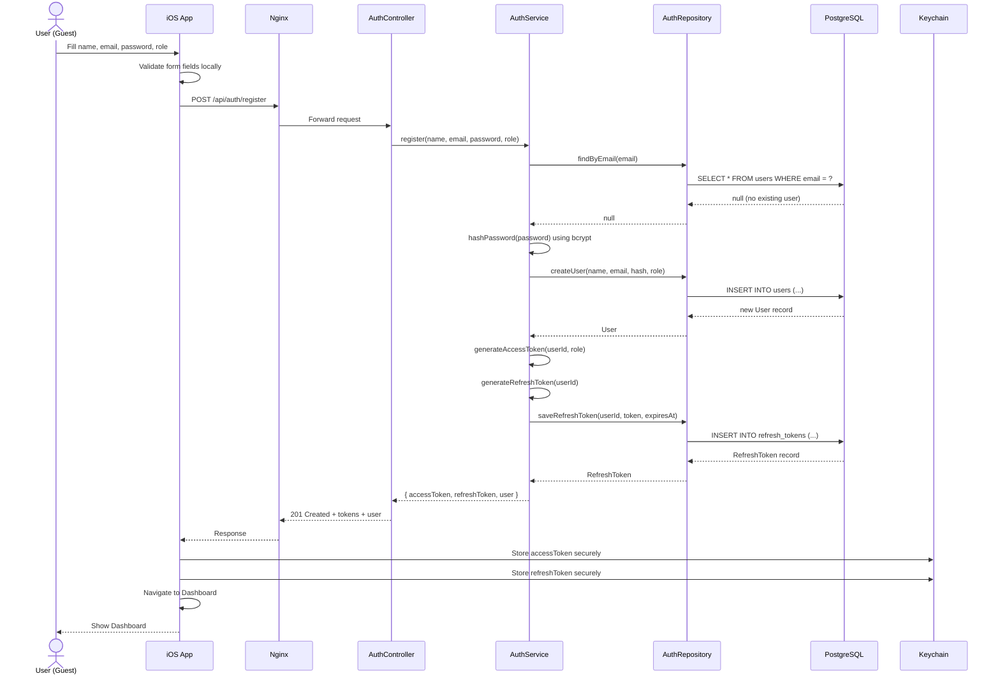

---

## Flow 2 — User Login

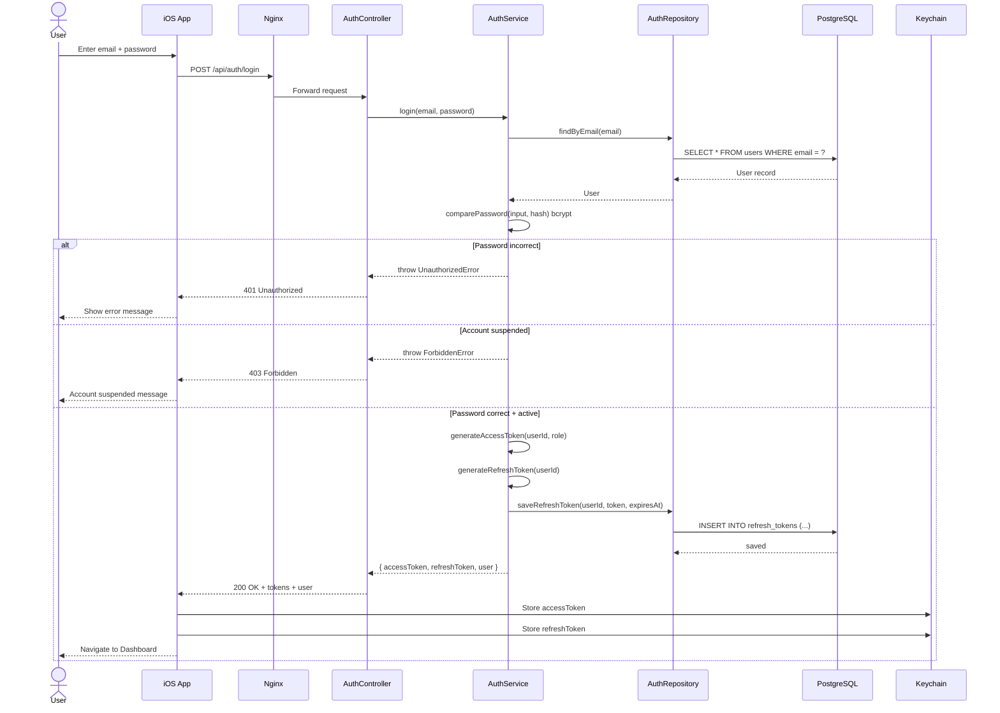

---

## Flow 3 — JWT Token Refresh

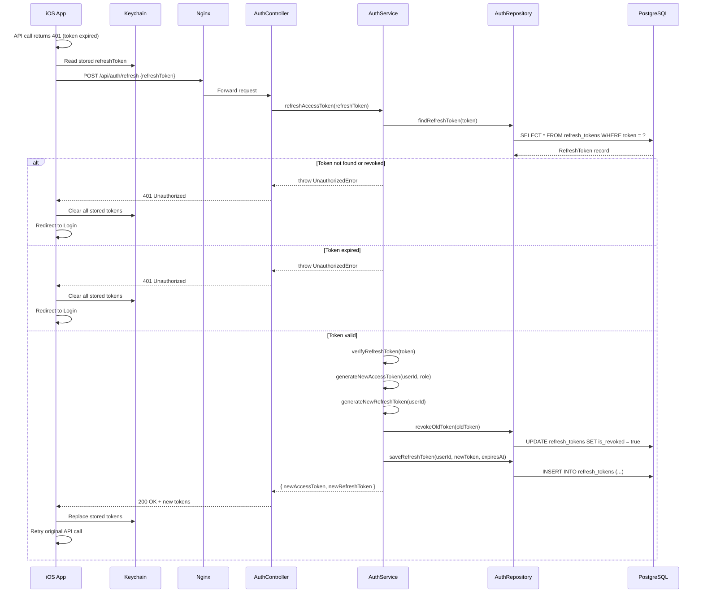

---

## Flow 4 — Worker Creates Profile and Adds Skill

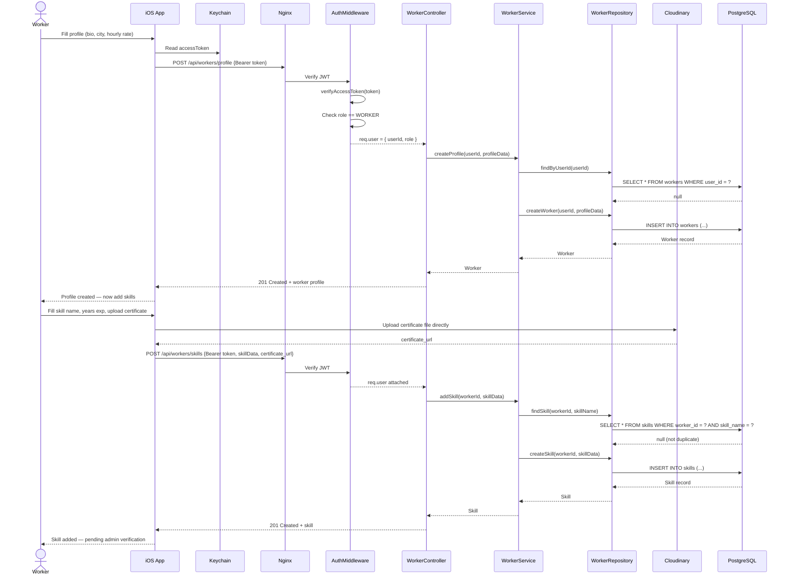

---

## Flow 5 — Employer Searches and Views Workers

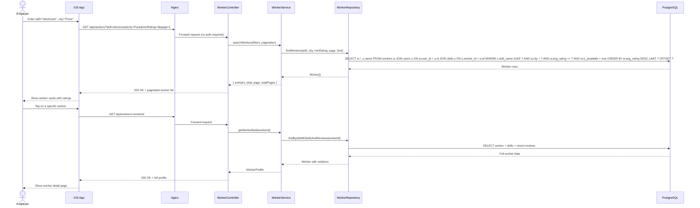

---

## Flow 6 — Employer Posts a Job

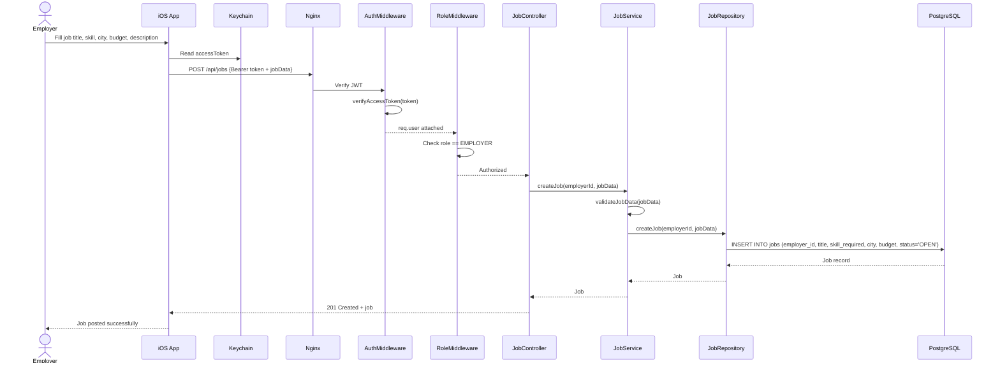

---

## Flow 7 — Worker Applies to a Job

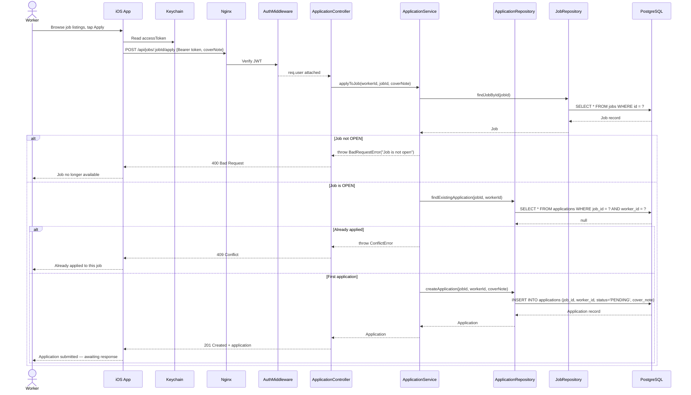

---

## Flow 8 — Employer Accepts Application and Completes Job

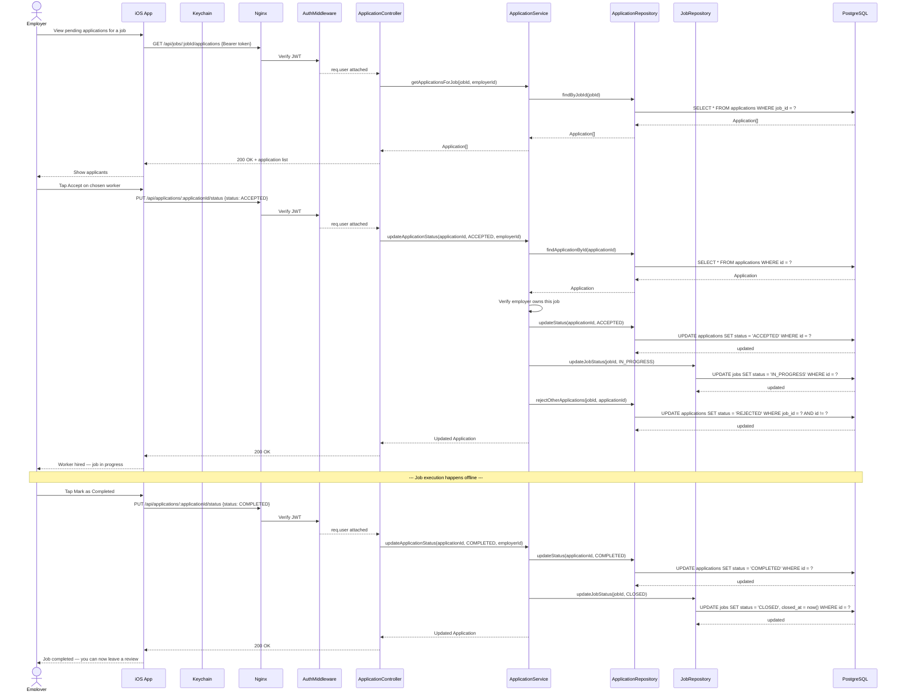

---

## Flow 9 — Employer Leaves a Review

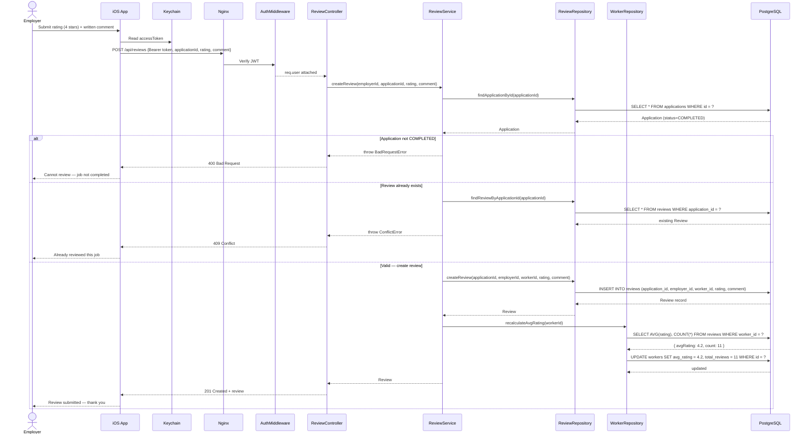

---

## Flow 10 — Admin Verifies a Worker

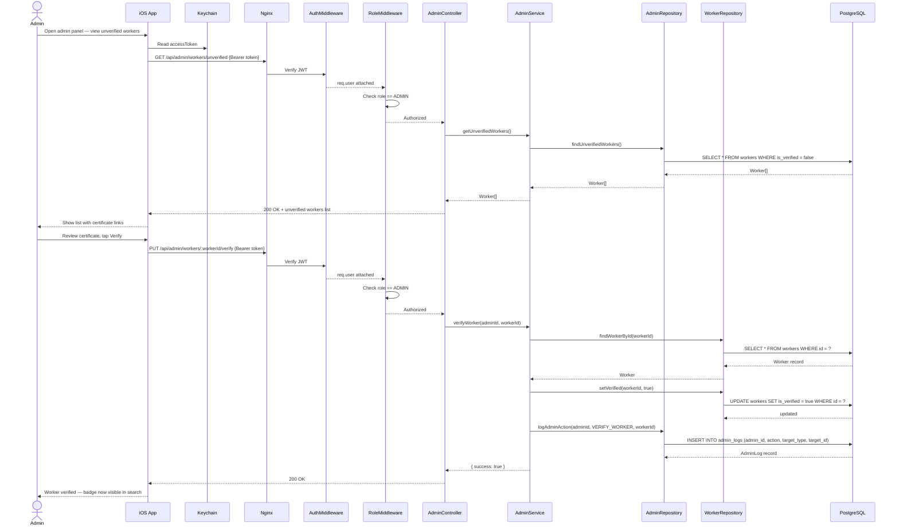

---

## Flow 11 — Logout

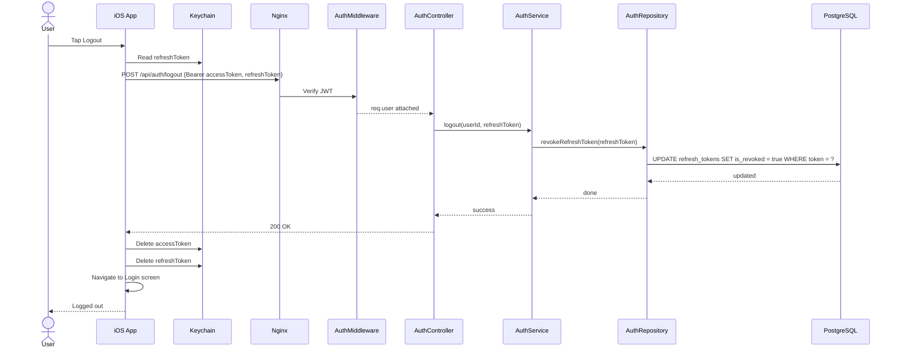

---

## Flow Summary Table

| Flow | Actors | Key Components | Auth Required |
|---|---|---|---|
| 1. Register | Guest | AuthController → AuthService → AuthRepository | No |
| 2. Login | Any user | AuthController → AuthService → AuthRepository | No |
| 3. Token Refresh | System | AuthController → AuthService → AuthRepository | Refresh token |
| 4. Create Worker Profile + Add Skill | Worker | WorkerController → WorkerService → WorkerRepository → Cloudinary | Yes (Worker) |
| 5. Search Workers | Guest, Employer | WorkerController → WorkerService → WorkerRepository | No |
| 6. Post a Job | Employer | JobController → JobService → JobRepository | Yes (Employer) |
| 7. Apply to Job | Worker | ApplicationController → ApplicationService → ApplicationRepository | Yes (Worker) |
| 8. Accept Application + Complete Job | Employer | ApplicationController → ApplicationService → ApplicationRepository + JobRepository | Yes (Employer) |
| 9. Leave Review | Employer | ReviewController → ReviewService → ReviewRepository → WorkerRepository | Yes (Employer) |
| 10. Admin Verify Worker | Admin | AdminController → AdminService → AdminRepository + WorkerRepository | Yes (Admin) |
| 11. Logout | Any user | AuthController → AuthService → AuthRepository → Keychain | Yes |

---

## Error Handling Pattern

All flows follow a consistent error response pattern handled by the global `errorHandler` middleware:

```
Controller calls Service
    │
    ├── Service throws AppError (custom class)
    │       ├── UnauthorizedError  → 401
    │       ├── ForbiddenError     → 403
    │       ├── NotFoundError      → 404
    │       ├── ConflictError      → 409
    │       ├── BadRequestError    → 400
    │       └── ValidationError    → 422
    │
    └── errorHandler middleware catches and formats:
            {
              "status": "error",
              "code": 404,
              "message": "Worker not found"
            }
```

Every alternate flow shown in the diagrams above maps to one of these error types — giving the iOS app consistent, predictable error codes to display appropriate UI messages.