# Use Case Diagram — SkillBridge

This document describes all actors and their interactions with the SkillBridge platform.

---

## Actors

| Actor | Description |
|---|---|
| **Guest** | Unauthenticated visitor — can browse and search but cannot hire or apply |
| **Worker** | Registered blue-collar worker — lists skills, applies to jobs, manages profile |
| **Employer** | Registered employer — posts jobs, searches and hires workers |
| **Admin** | Platform operator — verifies workers, moderates content, manages users |
| **System** | Automated platform actions — token refresh, rating recalculation, notifications |

---

## Use Case Diagram

```mermaid
graph TB
    subgraph Actors
        G(["👤 Guest"])
        W(["🔧 Worker"])
        E(["🏢 Employer"])
        A(["🛡️ Admin"])
        S(["⚙️ System"])
    end

    subgraph SkillBridge Platform
        subgraph Authentication
            UC1["Register Account"]
            UC2["Login"]
            UC3["Logout"]
            UC4["Refresh Token"]
        end

        subgraph Browse & Discovery
            UC5["Browse Worker Profiles"]
            UC6["Search Workers by Skill"]
            UC7["Filter by City / Rating / Rate"]
            UC8["View Worker Profile"]
        end

        subgraph Worker Management
            UC9["Create Worker Profile"]
            UC10["Update Worker Profile"]
            UC11["Add Skill with Certificate"]
            UC12["Remove Skill"]
            UC13["Set Availability Status"]
            UC14["View Own Dashboard"]
        end

        subgraph Job Management
            UC15["Post a Job"]
            UC16["View Job Listings"]
            UC17["Apply to a Job"]
            UC18["Send Direct Hire Request"]
            UC19["Accept Job Application"]
            UC20["Reject Job Application"]
            UC21["Mark Job as Completed"]
        end

        subgraph Reviews & Reputation
            UC22["Leave Review for Worker"]
            UC23["View Worker Reviews"]
            UC24["Recalculate Avg Rating"]
        end

        subgraph Admin Panel
            UC25["View Unverified Workers"]
            UC26["Verify Worker Credentials"]
            UC27["Reject Verification Request"]
            UC28["Suspend User Account"]
            UC29["Remove User Account"]
            UC30["View Platform Analytics"]
        end
    end

    G --> UC1
    G --> UC2
    G --> UC5
    G --> UC6
    G --> UC7
    G --> UC8
    G --> UC23

    W --> UC1
    W --> UC2
    W --> UC3
    W --> UC9
    W --> UC10
    W --> UC11
    W --> UC12
    W --> UC13
    W --> UC14
    W --> UC16
    W --> UC17

    E --> UC1
    E --> UC2
    E --> UC3
    E --> UC5
    E --> UC6
    E --> UC7
    E --> UC8
    E --> UC15
    E --> UC16
    E --> UC18
    E --> UC19
    E --> UC20
    E --> UC21
    E --> UC22
    E --> UC23

    A --> UC2
    A --> UC3
    A --> UC25
    A --> UC26
    A --> UC27
    A --> UC28
    A --> UC29
    A --> UC30

    S --> UC4
    S --> UC24

    UC4 -. "extends" .-> UC2
    UC24 -. "extends" .-> UC22
    UC11 -. "includes" .-> UC10
    UC18 -. "includes" .-> UC15
    UC19 -. "includes" .-> UC21
```

---

## Detailed Use Cases

### UC1 — Register Account

| Field | Detail |
|---|---|
| **Actor** | Guest |
| **Precondition** | User is not already registered |
| **Main Flow** | 1. User opens registration page → 2. Fills name, email, password, role (Worker/Employer) → 3. System validates input → 4. System hashes password → 5. System creates user record → 6. System returns JWT access + refresh token → 7. User is redirected to dashboard |
| **Alternate Flow** | Email already exists → System returns 409 Conflict error |
| **Postcondition** | New user account created, user is authenticated |

---

### UC2 — Login

| Field | Detail |
|---|---|
| **Actor** | Worker, Employer, Admin, Guest |
| **Precondition** | User has a registered account |
| **Main Flow** | 1. User enters email and password → 2. System finds user by email → 3. System compares bcrypt hash → 4. System generates JWT access token (15 min) + refresh token (7 days) → 5. Tokens returned to client → 6. Client stores tokens securely (Keychain on iOS) |
| **Alternate Flow** | Wrong password → 401 Unauthorized. Account suspended → 403 Forbidden |
| **Postcondition** | User is authenticated with valid tokens |

---

### UC6 — Search Workers by Skill

| Field | Detail |
|---|---|
| **Actor** | Guest, Employer |
| **Precondition** | None (public endpoint) |
| **Main Flow** | 1. User enters skill keyword (e.g. "electrician") → 2. Optional: apply filters (city, min rating, max rate) → 3. System queries DB with filters → 4. Returns paginated list of matching verified workers sorted by rating |
| **Alternate Flow** | No workers found → Empty list with suggestion to broaden filters |
| **Postcondition** | Employer sees relevant worker listings |

---

### UC9 — Create Worker Profile

| Field | Detail |
|---|---|
| **Actor** | Worker |
| **Precondition** | Worker is authenticated. Profile does not already exist |
| **Main Flow** | 1. Worker fills bio, city, hourly rate, availability → 2. Worker uploads profile photo (optional) → 3. System validates and creates worker profile → 4. Profile marked as "Unverified" until admin reviews |
| **Alternate Flow** | Profile already exists → 409 Conflict |
| **Postcondition** | Worker profile created, visible in search (unverified badge) |

---

### UC11 — Add Skill with Certificate

| Field | Detail |
|---|---|
| **Actor** | Worker |
| **Precondition** | Worker has a profile. Worker is authenticated |
| **Main Flow** | 1. Worker selects skill name and enters years of experience → 2. Worker uploads certificate file (PDF/image) → 3. System uploads file to Cloudinary → 4. System stores skill record with certificate URL → 5. Admin is flagged to verify |
| **Alternate Flow** | Invalid file type → 400 Bad Request |
| **Postcondition** | Skill added to worker profile with certificate URL stored |

---

### UC15 — Post a Job

| Field | Detail |
|---|---|
| **Actor** | Employer |
| **Precondition** | Employer is authenticated |
| **Main Flow** | 1. Employer fills job title, required skill, city, budget, description → 2. System validates input → 3. Job created with status `OPEN` → 4. Job appears in public job listings |
| **Alternate Flow** | Validation error → 422 with field-level error messages |
| **Postcondition** | Job posted and visible to workers |

---

### UC17 — Apply to a Job

| Field | Detail |
|---|---|
| **Actor** | Worker |
| **Precondition** | Worker is authenticated. Job status is `OPEN`. Worker has not already applied |
| **Main Flow** | 1. Worker views open job listing → 2. Worker taps "Apply" → 3. System creates application record with status `PENDING` → 4. Employer sees new application on dashboard |
| **Alternate Flow** | Already applied → 409 Conflict. Job closed → 400 Bad Request |
| **Postcondition** | Application created, employer notified |

---

### UC18 — Send Direct Hire Request

| Field | Detail |
|---|---|
| **Actor** | Employer |
| **Precondition** | Employer is authenticated. Employer has an open job posted |
| **Main Flow** | 1. Employer views worker profile → 2. Taps "Hire" → selects which job → 3. System creates application record directly with status `PENDING` → 4. Worker sees hire request on dashboard |
| **Alternate Flow** | No open jobs → Employer prompted to post a job first |
| **Postcondition** | Worker receives direct hire request |

---

### UC19 — Accept Job Application

| Field | Detail |
|---|---|
| **Actor** | Employer |
| **Precondition** | Application exists with status `PENDING` |
| **Main Flow** | 1. Employer views pending applications → 2. Taps "Accept" on preferred worker → 3. System updates application status to `ACCEPTED` → 4. Job status updated to `IN_PROGRESS` → 5. Other pending applications for same job auto-rejected |
| **Alternate Flow** | Application already accepted/rejected → 400 Bad Request |
| **Postcondition** | One application accepted, job marked in progress |

---

### UC21 — Mark Job as Completed

| Field | Detail |
|---|---|
| **Actor** | Employer |
| **Precondition** | Job status is `IN_PROGRESS`. Application status is `ACCEPTED` |
| **Main Flow** | 1. Employer marks job as done → 2. System updates application to `COMPLETED` → 3. System updates job status to `CLOSED` → 4. Review prompt unlocked for employer |
| **Postcondition** | Job closed, review window opens |

---

### UC22 — Leave Review for Worker

| Field | Detail |
|---|---|
| **Actor** | Employer |
| **Precondition** | Job is `COMPLETED`. No review exists for this job yet |
| **Main Flow** | 1. Employer submits rating (1–5) and written comment → 2. System creates review record → 3. System triggers UC24 (recalculate worker average rating) |
| **Alternate Flow** | Review already submitted → 409 Conflict |
| **Postcondition** | Review saved, worker average rating updated |

---

### UC26 — Verify Worker Credentials

| Field | Detail |
|---|---|
| **Actor** | Admin |
| **Precondition** | Worker has submitted profile with at least one skill certificate. Worker is not yet verified |
| **Main Flow** | 1. Admin views unverified worker list → 2. Admin opens worker profile, reviews certificate → 3. Admin clicks "Verify" → 4. System sets `isVerified = true` on worker record → 5. Worker profile now shows verified badge in search results |
| **Alternate Flow** | Admin clicks "Reject" → Worker notified to resubmit |
| **Postcondition** | Worker marked as verified, visible with trust badge |

---

## Use Case Summary Table

| Use Case | Guest | Worker | Employer | Admin |
|---|---|---|---|---|
| Register | ✅ | ✅ | ✅ | — |
| Login | ✅ | ✅ | ✅ | ✅ |
| Browse/Search workers | ✅ | — | ✅ | — |
| Create worker profile | — | ✅ | — | — |
| Add skill + certificate | — | ✅ | — | — |
| Post a job | — | — | ✅ | — |
| Apply to job | — | ✅ | — | — |
| Send direct hire request | — | — | ✅ | — |
| Accept / reject application | — | — | ✅ | — |
| Mark job completed | — | — | ✅ | — |
| Leave review | — | — | ✅ | — |
| Verify worker credentials | — | — | — | ✅ |
| Suspend / remove user | — | — | — | ✅ |
| View platform analytics | — | — | — | ✅ |